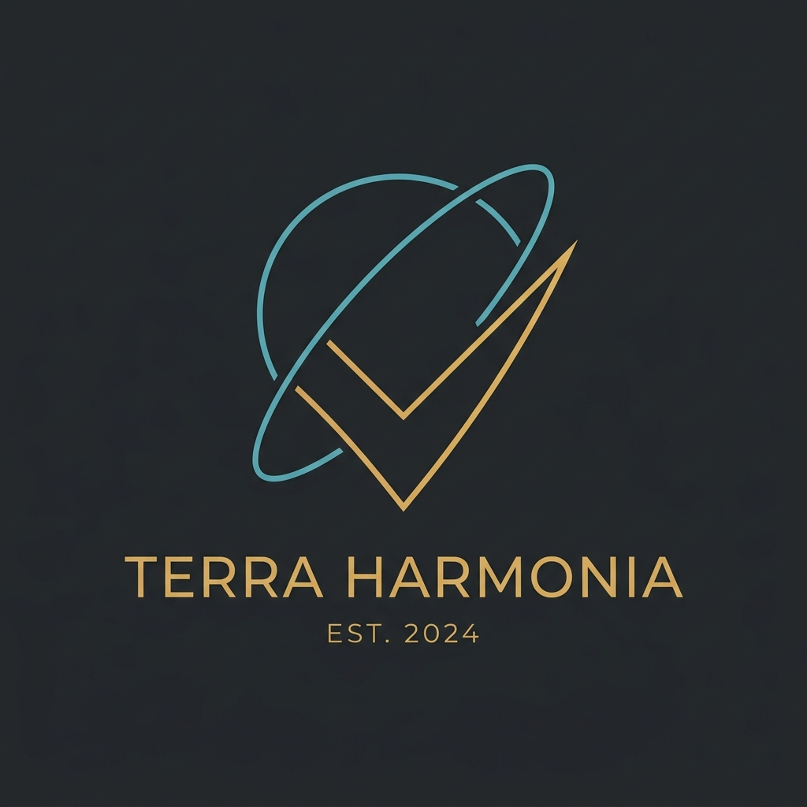

# Terra Harmonia

> NASA Space Apps Challenge 2026: **Harmonization of MODIS and VIIRS Hot Spots**



Terra Harmonia is an earth observation analytics platform designed to solve the multi-sensor resolution fragmentation between NASA's MODIS (2000 to present, 1 km resolution) and VIIRS (2012 to present, 375 m resolution) active fire records.

By harmonizing 26 years of continuous satellite observation data, Terra Harmonia eliminates spurious fire count inflation, produces an equalized multi-decade Burning Activity Calendar, and delivers actionable early warning intelligence for environmental land managers.

---

## The Challenge

For more than two decades, satellite remote sensing has tracked global wildfires using NASA Earth observation instruments:
1. **MODIS (Terra & Aqua satellites)**: 1 km pixel footprint, continuous record since 2000.
2. **VIIRS (Suomi-NPP & NOAA-20 satellites)**: 375 m pixel footprint, deployed starting late 2011.

Because VIIRS has an area per pixel ~7 times smaller than MODIS, a single wildfire perimeter that registers as **1 MODIS detection** often triggers **3 to 7 separate VIIRS detections**. 

Without mathematical and spatial harmonization, raw historical archives create a dangerous statistical illusion: that wildfire occurrence abruptly tripled after 2012. This distorts long-term climate baselines, fire frequency studies, and emergency response allocation.

---

## Core Innovations

### 1. 5.5 km Equal-Area Spatial Binning
- Detections from overlapping satellite passes occurring within 5.5 km grid cells are aggregated into discrete, coherent fire cluster events.
- Eliminates duplicate counting while preserving physical spatial distribution.

### 2. Cross-Sensor FRP (Fire Radiative Power) Calibration
- Applies sensor-specific energy weight factors (MODIS: 1.04, VIIRS: 0.88) to normalize total radiative energy flux (MW) into an equalized standard metric across both instrument generations.

### 3. Unified 26-Year Burning Activity Calendar (2000 to 2026)
- Visualizes 52 weeks across 26 years (1,352 matrix cells) with standardized Burning Activity Index scores (0 to 100).
- Supports dual visual modes:
  - **Full Matrix Mode**: Complete multi-decade bird's eye view of burning patterns.
  - **Year Card Mode**: Focused month-by-month breakdown optimized for smaller viewports.
  - **Raw Mode vs Harmonized Toggle**: Instant interactive demonstration proving why uncalibrated raw counts mislead compared to harmonized clusters.

### 4. Statistical Anomaly & Early Warning Engine
- Calculates running multi-year mean and standard deviation baselines per calendar week.
- Detects abnormal spikes exceeding statistical thresholds ($Z > 2.0\sigma$).
- Identifies critical peak burning seasons (e.g. Weeks 30 to 42 in tropical peatlands) to issue actionable pre-season land management directives.

### 5. Native Bilingual Support (English & Bahasa Indonesia)
- Instant one-click toggle between English and Bahasa Indonesia.
- Culturally accurate, professional terminology tailored for ASEAN peatland wildfire authorities (e.g. BRGM, BNPB, KLHK) as well as international researchers.

---

## Technical Architecture

- **Framework**: React 18 with TypeScript
- **Styling**: Tailwind CSS (accessible high-contrast dark theme, WCAG AA compliant)
- **Geospatial Mapping**: Leaflet with Esri World Dark Gray Base Cartography
- **Icons**: Lucide React
- **Build Tool**: Vite

---

## Project Structure

```
src/
├── components/
│   ├── BurningCalendar.tsx      # 26-Year interactive matrix & year cards
│   ├── ComparisonMetrics.tsx    # Longitudinal era comparison & calibration science
│   ├── CriticalAlerts.tsx       # Early warning forecast, anomaly table & CSV export
│   ├── DashboardControlBar.tsx  # Region picker, harmonized/raw toggle, live clock
│   ├── Header.tsx               # Minimalist navbar with language & team modal triggers
│   ├── MapViewer.tsx            # Leaflet map displaying active fire clusters
│   └── TeamModal.tsx            # Team identity & project methodology dossier
├── data/
│   ├── generator.ts             # Calibrated multi-decade satellite records
│   └── translations.ts          # Complete EN and ID localization dictionary
├── engine/
│   └── harmonizer.ts            # Spatial binning, FRP weighting, and Z-score engine
├── App.tsx                      # Root dashboard coordinator
└── main.tsx                     # Vite entry point
```

---

## Getting Started

### Prerequisites
- Node.js (v18 or higher recommended)
- npm or yarn

### Installation
```bash
# Clone the repository
git clone https://github.com/Rangga11268/TerraHarmonia.git
cd TerraHarmonia

# Install dependencies
npm install

# Run the local development server
npm run dev
```

The application will be accessible at `http://localhost:3000/` (or port assigned by Vite).

### Production Build
```bash
npm run build
```

---

## Team Dossier

- **Team Name**: Terra Harmonia
- **Challenge**: NASA Space Apps Challenge 2026: Harmonization of MODIS and VIIRS Hot Spots
- **Participant**: Darell Rangga (Solo Participant)
- **Open Data Sources**: NASA FIRMS (Fire Information for Resource Management System), MODIS (Terra/Aqua), VIIRS (Suomi-NPP/NOAA-20)
